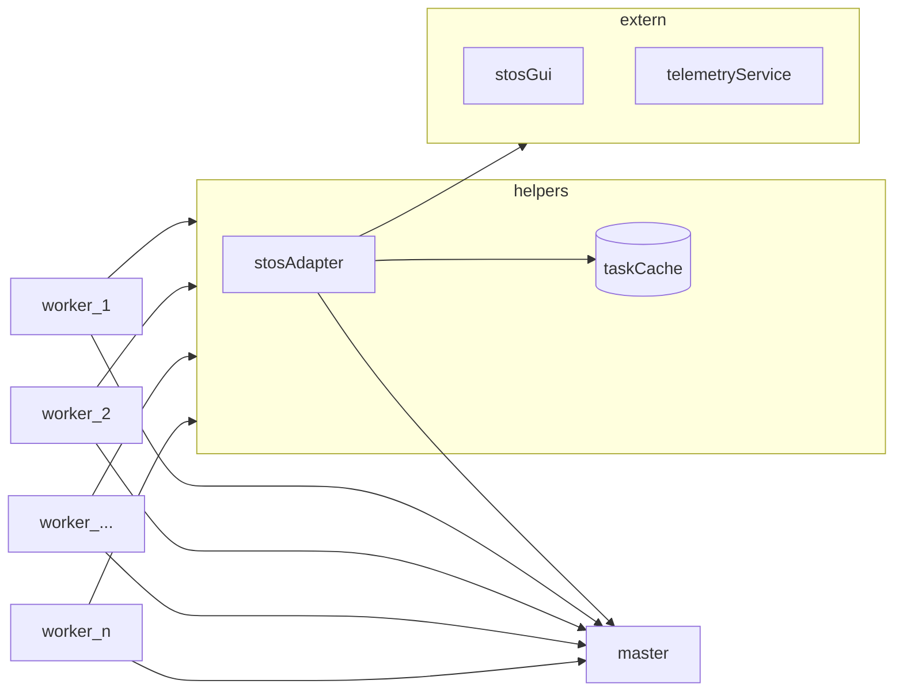
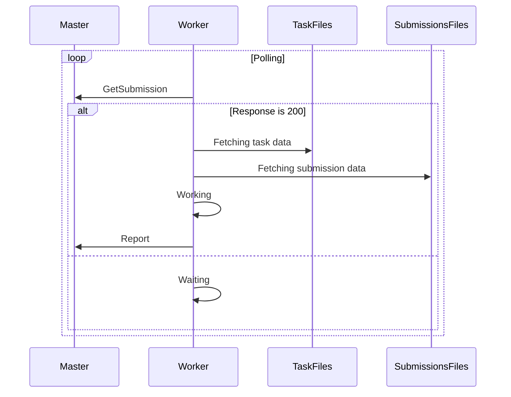

# Projekt_Inżynierski-2025

> [!WARNING]
> Work is still in progress. Things can change.

# Containers Graph

```mermaid
graph LR
  worker1[worker_1] --> master
  worker2[worker_2] --> master
  worker3[worker_...] --> master
  worker4[worker_n] --> master

  worker1 --> helpers
  worker2 --> helpers
  worker3 --> helpers
  worker4 --> helpers

  stosAdapter --> master

  stosAdapter --> extern

  subgraph helpers
    stosAdapter[stosAdapter] --> taskCache[(taskCache)]

  end
  
  subgraph extern
    stosGui
    telemetryService
  end
```
> [!NOTE]
> Cache not implemented yet

hr

# Sequence Diagram

```mermaid
sequenceDiagram
    participant Master
    participant Worker
    participant TaskFiles
    participant SubmissionsFiles
    
    loop Polling
        Worker->>Master: GetSubmission
        alt Response is 200
            Worker->>TaskFiles: Fetching task data
            Worker->>SubmissionsFiles: Fetching submission data
            Worker->>Worker: Working
            Worker->>Master: Report
        else
          Worker->>Worker: Waiting
        end
    end
```
