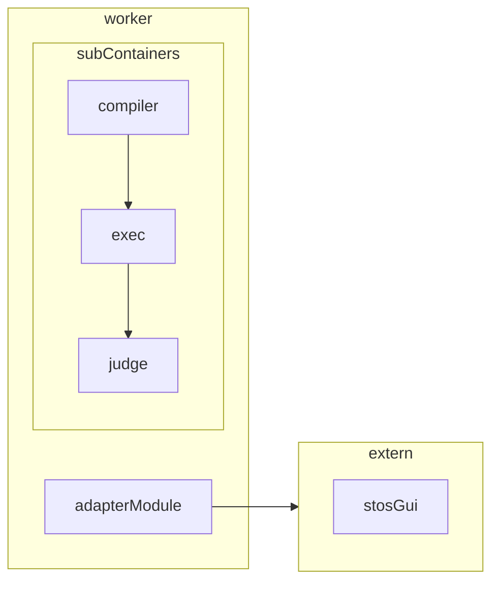
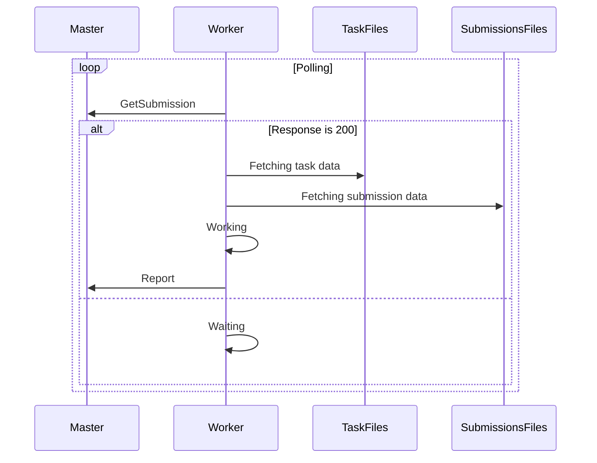

# Projekt_Inżynierski-2025

> [!IMPORTANT]
> Work is still in progress. Things can change.

# Containers Graph

```mermaid
graph LR
  adapterModule --> extern

  subgraph worker
    adapterModule
    subgraph subContainers
      compiler --> exec
      exec --> judge
    end

  end
  
  subgraph extern
    stosGui
  end
```
> [!NOTE]
> Cache and adapter not implemented yet

---

# Sequence Diagram

```mermaid
sequenceDiagram
    participant Master
    participant Worker
    participant TaskFiles
    participant SubmissionsFiles
    
    loop Polling
        Worker->>Master: GetSubmission
        alt Response is 200
            Worker->>TaskFiles: Fetching task data
            Worker->>SubmissionsFiles: Fetching submission data
            Worker->>Worker: Working
            Worker->>Master: Report
        else
          Worker->>Worker: Waiting
        end
    end
```

